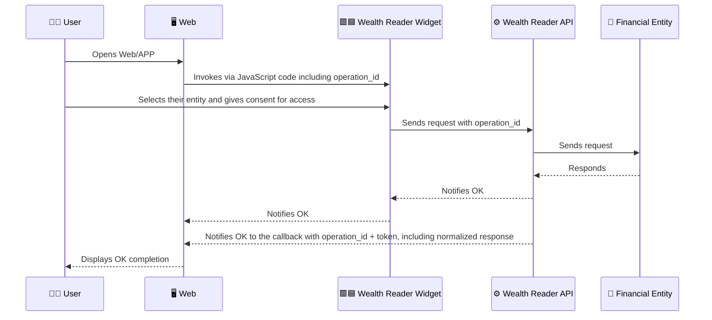

# ↔️ Flow

```mermaid
sequenceDiagram
    participant 👨‍💼 User
    participant 🖥️ Web
    participant 🟥🟦 Wealth Reader Widget
    participant ⚙️ Wealth Reader API
    participant 🏦 Financial Entity
    👨‍💼 User->>🖥️ Web: Opens Web/APP
    🖥️ Web->>🟥🟦 Wealth Reader Widget: Invokes via JavaScript code including operation_id
    👨‍💼 User->>🟥🟦 Wealth Reader Widget: Selects their entity and gives consent for access
    🟥🟦 Wealth Reader Widget->>⚙️ Wealth Reader API: Sends request with operation_id
    ⚙️ Wealth Reader API->>🏦 Financial Entity: Sends request
    🏦 Financial Entity-->>⚙️ Wealth Reader API: Responds
    ⚙️ Wealth Reader API-->>🟥🟦 Wealth Reader Widget: Notifies OK
    🟥🟦 Wealth Reader Widget-->>🖥️ Web: Notifies OK
    ⚙️ Wealth Reader API-->>🖥️ Web: Notifies OK to the callback with operation_id + token, including normalized response
    🖥️ Web-->>👨‍💼 User: Displays OK completion
```
